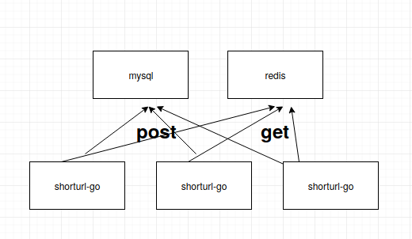
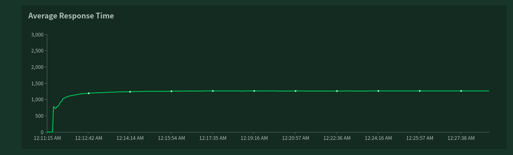
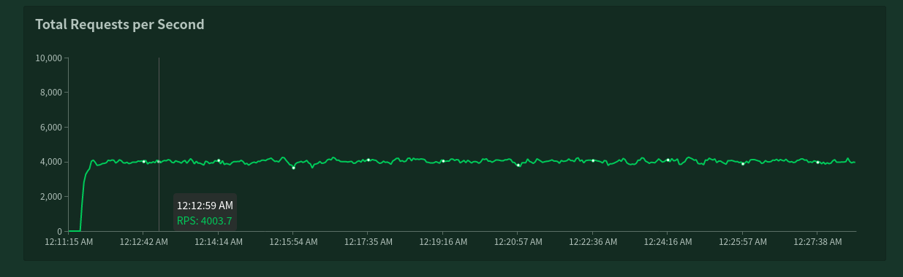

# SE419-SE422-proj
project for course SE419&amp;SE422
## Overview
### load-test
* 使用实验室提供的openstack机器集群
* 12CPU, 24GB
* 使用microk8s安装kubernetes集群
* 配置文件可见 /load-test-locust
* 1个master，12个slave，确保能够产生足够数量的user connection
* 写：读 = 3 ： 7

### short url instance
* go语言写short url的业务逻辑
    * 具体见/instance/shorturl-go
    * 使用static compiler，生成无需依赖的二进制，可无需环境，直接运行。
    * go语言http包对并发很支持
    * 使用 /instance/shorturl-go/build-container打包镜像，并且上传到我的dockerhub
* mysql
    * 具体见/instances/mysql
    * 创建了scheme
    * 打包镜像，上传到dockerhub
* redis
    * 直接使用redis镜像，未制作镜像

### short url business logic
* 具体可见/instance/shorturl-go/shorturl.go
* 连接mysql与redis
* redis作为缓存服务器
* 每次post，将上传的url储存到mysql中，并且mysql的primary key auto_increment
* 每次get，先在redis检查是否存在该短链接的key
    * 如果存在直接返回key对应的value，即所查找的url
    * 如果不存在，从mysql中获取该url，并且将对应的key value储存在redis中，设置expire date为1小时，防止内存guoda。
* 实际上在load-test中几乎所有的get都是从redis中获取，因此也是一种变相的读写分离。

### short url deployment
* 使用AWS
* 配置了两台机器，每台4CPU， 8G
* 使用kubeadm安装kubernetes集群
* kubeadm基于物理机而非虚拟化，相比microk8s更适合生产环境
* mysql
    * 为mysql配置了stateful deployment所需要的PV(shorturl/shorturl-mysql-pv.yaml)
    * mysql deployment(shorturl/shorturl-mysql-deployment.yaml)
    * mysql端口3306开放给其他服务(shorturl/shorturl-mysql-deployment.yaml)
* redis
    * 作为缓存服务器，因此丢失没事，没有使用stateful deployment
    * redis deployment(shorturl/redis.yaml)
    * redis端口6379开放给其他服务(shorturl/redis.yaml)
* shorturl-go
    * 业务逻辑服务器
    * 创建了10个实例
    * 每个实例为redis最多建立1000个连接（redis最多10000个连接）
    * 每个实例为mysql最多建立800个连接（mysql最多100000个连接，但是实际上在所在环境中到达3500，response time 已经无法忍受了）

## Result
* 最大load-test： 10000用户并发，基本处于可以忍受的范围
* 测定15分钟后
    * average response time稳定在1.25s
    
    * rps稳定在4000
    
* 5000用户并发，效果挺好。（TODO:add images）